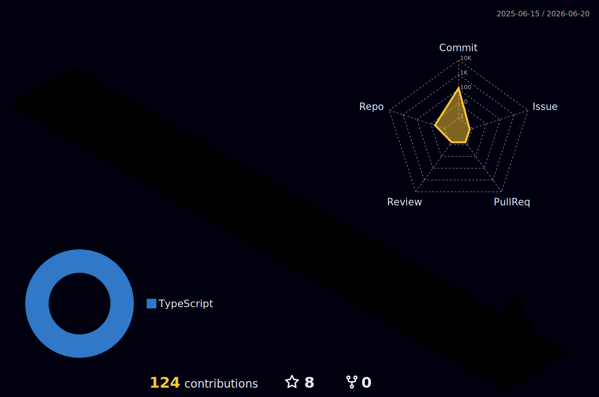

---

## 嗨，我是 Sanli 👋

前端工程师 @ 字节跳动 · 喜欢造东西 · 关注 AI 如何改变生活

_Frontend Engineer · Building side projects · Exploring the AI-powered future_

---

## 📊 GitHub Stats

---

## 📈 Contribution Graph

<picture>
  <source media="(prefers-color-scheme: dark)" srcset="https://github-readme-activity-graph.vercel.app/graph?username=648lsp666&theme=tokyo-night&bg_color=0a0a0a&color=22d3ee&line=22d3ee&point=ffffff&hide_border=true" />
  <source media="(prefers-color-scheme: light)" srcset="https://github-readme-activity-graph.vercel.app/graph?username=648lsp666&theme=xcode&hide_border=true" />
  
</picture>

---

## 🏗️ 3D Contribution Graph

---

## 🛠️ Tech Stack

---

## 🚀 Projects

---

## 🐍 Contribution Snake

<picture>
  <source media="(prefers-color-scheme: dark)" srcset="https://raw.githubusercontent.com/648lsp666/648lsp666/output/github-snake-dark.svg" />
  <source media="(prefers-color-scheme: light)" srcset="https://raw.githubusercontent.com/648lsp666/648lsp666/output/github-snake.svg" />
  
</picture>

---

_"好的产品是把复杂藏起来，把简单留给用户。"_

